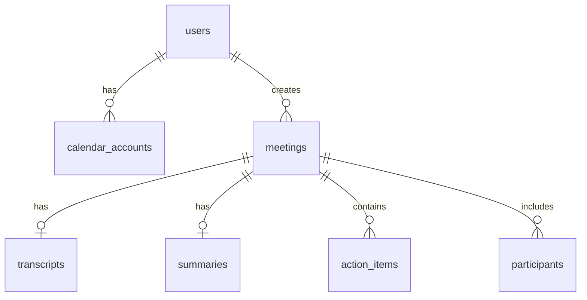

# Database Schema Documentation

> **Last Updated:** 2026-01-04  
> **Database:** PostgreSQL (Supabase)  
> **ORM:** Prisma

---

## Integration Compliance Matrix

| Service | Status | Notes |
|---------|--------|-------|
| **MeetingBaas API v2** | ✅ | All bot status codes, error codes, callback support |
| **Supabase** | ✅ | RLS policies, `auth.uid()`, real-time ready |
| **Google Calendar** | ✅ | OAuth tokens, event sync, refresh tokens |
| **Vercel** | ✅ | Serverless compatible, connection pooling via `directUrl` |

---

## Entity Relationship Diagram



---

## Tables Overview

| Table | Purpose | Key Integrations |
|-------|---------|------------------|
| `users` | User profiles | Supabase Auth |
| `calendar_accounts` | OAuth tokens | Google Calendar, MeetingBaas |
| `meetings` | Bot recordings | MeetingBaas API |
| `transcripts` | Full transcripts | Gladia (via MeetingBaas) |
| `summaries` | AI summaries | Gladia summarization |
| `action_items` | Extracted tasks | AI extraction |
| `participants` | Meeting attendees | MeetingBaas API |

---

## Table: `users`

Stores user profile data. Authentication is handled by **Supabase Auth**.

| Column | Type | Description |
|--------|------|-------------|
| `id` | UUID | Primary key. **Must match Supabase Auth `auth.uid()`** |
| `email` | TEXT | Unique email address |
| `name` | TEXT | Display name |
| `avatar_url` | TEXT | Profile picture URL |
| `created_at` | TIMESTAMPTZ | Account creation time |
| `updated_at` | TIMESTAMPTZ | Last update (auto-trigger) |

**RLS Policy:** Users can only read/update their own row.

---

## Table: `calendar_accounts`

Stores **Google Calendar OAuth tokens** for calendar sync.

| Column | Type | Description |
|--------|------|-------------|
| `id` | UUID | Primary key |
| `user_id` | UUID | FK → `users.id` |
| `provider` | TEXT | `google` or `microsoft` |
| `email` | TEXT | Calendar account email |
| `access_token` | TEXT | OAuth access token (⚠️ encrypt) |
| `refresh_token` | TEXT | OAuth refresh token (⚠️ encrypt) |
| `expires_at` | TIMESTAMPTZ | Token expiration |
| `scope` | TEXT | OAuth scopes granted |
| `meetingbaas_calendar_id` | TEXT | MeetingBaas calendar UUID |
| `is_active` | BOOLEAN | Whether sync is enabled |

**References:**
- [Google OAuth 2.0](https://developers.google.com/identity/protocols/oauth2)
- [MeetingBaas POST /calendars](https://doc.meetingbaas.com/api-reference/calendars/sync-calendar)

---

## Table: `meetings`

Stores **MeetingBaas bot** recordings and metadata.

| Column | Type | MeetingBaas Field | Description |
|--------|------|-------------------|-------------|
| `id` | UUID | - | Internal ID |
| `user_id` | UUID | - | FK → `users.id` |
| `bot_id` | TEXT | `bot_id` | MeetingBaas bot UUID |
| `bot_name` | TEXT | `bot_name` | Display name in meeting |
| `meeting_url` | TEXT | `meeting_url` | Zoom/Meet/Teams URL |
| `calendar_event_id` | TEXT | `event_id` | If scheduled via calendar |
| `status` | TEXT | `status` | See status codes below |
| `recording_mode` | TEXT | `recording_mode` | `speaker_view`, `gallery_view`, `audio_only` |
| `duration_seconds` | INT | `duration_seconds` | Recording length |
| `participant_count` | INT | - | Number of attendees |
| `video_url` | TEXT | `mp4` | Recording download URL |
| `audio_url` | TEXT | - | Audio-only URL |
| `transcript_url` | TEXT | `transcript.txt` | Transcript file URL |
| `diarization_url` | TEXT | `diarization` | Speaker identification |
| `error_code` | TEXT | `error_code` | See error codes below |
| `error_message` | TEXT | `error_message` | Human-readable error |
| `end_reason` | TEXT | `end_reason` | Why recording ended |
| `created_at` | TIMESTAMPTZ | `created_at` | Bot creation time |
| `updated_at` | TIMESTAMPTZ | - | Last update |
| `completed_at` | TIMESTAMPTZ | - | When recording finished |

### Bot Status Codes

Per [MeetingBaas API v2](https://doc.meetingbaas.com/api-reference/bots/get-meeting-data):

| Status | Description |
|--------|-------------|
| `queued` | Bot created, waiting to join |
| `joining_call` | Bot is joining the meeting |
| `in_waiting_room` | Bot is in waiting room |
| `in_call_not_recording` | Bot in call, not recording yet |
| `in_call_recording` | Bot actively recording |
| `recording_paused` | Recording paused |
| `recording_resumed` | Recording resumed |
| `transcribing` | Processing transcription |
| `completed` | Successfully completed |
| `failed` | Bot failed (see `error_code`) |

### Error Codes

Per [MeetingBaas Error Reference](https://doc.meetingbaas.com/api-reference/bots/get-meeting-data):

| Code | Description |
|------|-------------|
| `BOT_NOT_ACCEPTED` | Participants didn't admit bot |
| `TIMEOUT_WAITING_TO_START` | No one joined meeting |
| `CANNOT_JOIN_MEETING` | Meeting not reachable |
| `INVALID_MEETING_URL` | URL format invalid |
| `TRANSCRIPTION_FAILED` | Transcription error (retry-able) |
| `INSUFFICIENT_TOKENS` | Account balance issue |
| `DAILY_BOT_CAP_REACHED` | Daily limit exceeded |

---

## Table: `transcripts`

Stores full transcript JSON from **Gladia** (via MeetingBaas).

| Column | Type | Description |
|--------|------|-------------|
| `id` | UUID | Primary key |
| `meeting_id` | UUID | FK → `meetings.id` |
| `data` | JSONB | Full transcript with utterances |

**JSON Structure:**
```json
{
  "utterances": [
    {
      "speaker": 0,
      "text": "Hello everyone",
      "start": 0.0,
      "end": 1.5,
      "words": [...]
    }
  ]
}
```

---

## Table: `summaries`

Stores AI-generated summaries from **Gladia summarization**.

| Column | Type | Description |
|--------|------|-------------|
| `id` | UUID | Primary key |
| `meeting_id` | UUID | FK → `meetings.id` |
| `overview` | TEXT | Meeting summary paragraph |
| `key_points` | TEXT[] | Bullet points array |
| `decisions` | TEXT[] | Decisions made |
| `next_steps` | TEXT[] | Action items |

---

## Table: `action_items`

Extracted tasks from meetings.

| Column | Type | Description |
|--------|------|-------------|
| `id` | UUID | Primary key |
| `meeting_id` | UUID | FK → `meetings.id` |
| `description` | TEXT | Task description |
| `assignee` | TEXT | Person responsible |
| `due_date` | TEXT | Due date string |
| `completed` | BOOLEAN | Completion status |

---

## Table: `participants`

Meeting attendees from MeetingBaas.

| Column | Type | Description |
|--------|------|-------------|
| `id` | UUID | Primary key |
| `meeting_id` | UUID | FK → `meetings.id` |
| `name` | TEXT | Participant name |
| `email` | TEXT | Email if available |
| `role` | TEXT | `host`, `participant` |
| `joined_at` | TIMESTAMPTZ | Join time |
| `left_at` | TIMESTAMPTZ | Leave time |

---

## Indices

| Index | Table | Columns | Purpose |
|-------|-------|---------|---------|
| `meetings_pkey` | meetings | id | Primary key |
| `meetings_bot_id_key` | meetings | bot_id | Unique constraint |
| `idx_meetings_user_created` | meetings | user_id, created_at | User's meetings list |
| `idx_meetings_status` | meetings | status | Status filtering |
| `idx_meetings_calendar_event` | meetings | calendar_event_id | Calendar sync |
| `idx_meetings_status_created` | meetings | status, created_at DESC | Dashboard queries |
| `idx_calendar_accounts_mb_id` | calendar_accounts | meetingbaas_calendar_id | Calendar lookups |

---

## Row Level Security

All tables have RLS enabled. Users can only access their own data.

```sql
-- Example policy
CREATE POLICY "Users can view own meetings" ON meetings
  FOR SELECT USING (auth.uid() = user_id);
```

---

## References

- [MeetingBaas API v2 Docs](https://doc.meetingbaas.com)
- [Supabase Auth](https://supabase.com/docs/guides/auth)
- [Google Calendar API](https://developers.google.com/calendar/api)
- [Prisma with Supabase](https://www.prisma.io/docs/guides/database/supabase)
