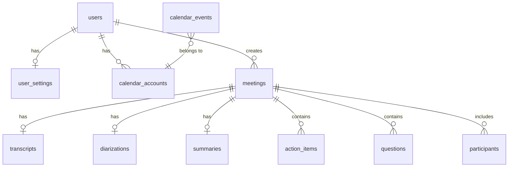

# Database Schema Documentation

> **Last Updated:** 2026-01-08  
> **Database:** PostgreSQL (Supabase)  
> **ORM:** Prisma

---

## Entity Relationship Diagram



---

## Tables Overview

| Table | Purpose | Key Integrations |
|-------|---------|------------------|
| `users` | User profiles (synced from auth) | Supabase Auth |
| `user_settings` | User preferences (custom vocabulary) | Claude AI |
| `calendar_accounts` | OAuth tokens for Google Calendar | Google Calendar, MeetingBaas |
| `meetings` | Bot recordings and metadata | MeetingBaas API |
| `transcripts` | Full transcripts with utterances | Gladia (via MeetingBaas) |
| `diarizations` | Speaker identification data | Gladia (via MeetingBaas) |
| `summaries` | AI-generated summaries | Claude AI |
| `action_items` | Extracted tasks | Claude AI |
| `questions` | Extracted Q&A from meetings | Claude AI |
| `participants` | Meeting attendees | MeetingBaas API |
| `calendar_events` | Cached calendar events | Google Calendar (via MeetingBaas) |

---

## Table: `users`

Stores user profile data synced from **Supabase Auth**.

| Column | Type | Description |
|--------|------|-------------|
| `id` | UUID | Primary key. **Must match Supabase Auth `auth.uid()`** |
| `email` | TEXT | Unique email address |
| `name` | TEXT | Display name (nullable) |
| `avatar_url` | TEXT | Profile picture URL (nullable) |
| `created_at` | TIMESTAMPTZ | Account creation time |
| `updated_at` | TIMESTAMPTZ | Last update (auto-trigger) |

**User Sync:** Users are synced via `ensureUserExists()` called in all authenticated API routes.

---

## Table: `user_settings`

Stores user preferences like **custom vocabulary** for transcription.

| Column | Type | Description |
|--------|------|-------------|
| `id` | UUID | Primary key |
| `user_id` | UUID | FK → `users.id` (unique) |
| `custom_vocabulary` | TEXT[] | Array of custom terms for transcription |
| `created_at` | TIMESTAMPTZ | Record creation |
| `updated_at` | TIMESTAMPTZ | Last update |

**Usage:** Custom vocabulary is passed to Gladia during transcription to improve accuracy of domain-specific terms.

---

## Table: `calendar_accounts`

Stores **Google Calendar OAuth tokens** for calendar sync.

| Column | Type | Description |
|--------|------|-------------|
| `id` | UUID | Primary key |
| `user_id` | UUID | FK → `users.id` |
| `provider` | TEXT | `google` (default) |
| `email` | TEXT | Calendar account email |
| `access_token` | TEXT | OAuth access token (🔒 AES-256-GCM encrypted) |
| `refresh_token` | TEXT | OAuth refresh token (🔒 encrypted, nullable) |
| `expires_at` | TIMESTAMPTZ | Token expiration |
| `scope` | TEXT | OAuth scopes granted |
| `meetingbaas_calendar_id` | TEXT | MeetingBaas calendar UUID (nullable) |
| `is_active` | BOOLEAN | Whether sync is enabled |
| `created_at` | TIMESTAMPTZ | Record creation |
| `updated_at` | TIMESTAMPTZ | Last update |

**Constraints:**
- Unique: `(user_id, provider, email)`

**Indices:**
- `meetingbaas_calendar_id` - Calendar lookups
- `user_id` - User's calendars
- `is_active` - Active calendar filtering

---

## Table: `meetings`

Stores **MeetingBaas bot** recordings and metadata. This is the **local cache** of meeting data.

| Column | Type | MeetingBaas Field | Description |
|--------|------|-------------------|-------------|
| `id` | UUID | - | Internal ID |
| `user_id` | UUID | - | FK → `users.id` |
| `bot_id` | TEXT | `bot_id` | MeetingBaas bot UUID (unique) |
| `bot_name` | TEXT | `bot_name` | Display name in meeting |
| `meeting_url` | TEXT | `meeting_url` | Zoom/Meet/Teams URL |
| `calendar_event_id` | TEXT | `event_id` | If scheduled via calendar (nullable) |
| `status` | TEXT | `status.code` | See status codes below |
| `recording_mode` | TEXT | `recording_mode` | `speaker_view` (default), `gallery_view`, `audio_only` |
| `duration_seconds` | INT | `duration_seconds` | Recording length (nullable) |
| `participant_count` | INT | - | Number of attendees (nullable) |
| `video_url` | TEXT | `mp4` | Recording download URL (expires 4h) |
| `audio_url` | TEXT | - | Audio-only URL (nullable) |
| `transcript_url` | TEXT | `transcript.txt` | Transcript file URL (nullable) |
| `diarization_url` | TEXT | `diarization` | Speaker identification URL (nullable) |
| `error_code` | TEXT | `error_code` | Error code if failed (nullable) |
| `error_message` | TEXT | `error_message` | Human-readable error (nullable) |
| `end_reason` | TEXT | `end_reason` | Why recording ended (nullable) |
| `processing_status` | TEXT | - | `pending`, `processing`, `completed`, `failed` |
| `extra` | JSON | `extra` | Extra webhook data (includes `user_id` for owner identification) |
| `scheduled_start` | TIMESTAMPTZ | - | Scheduled meeting start time (for filtering past vs future) |
| `scheduled_end` | TIMESTAMPTZ | - | Scheduled meeting end time (for filtering past vs future) |
| `created_at` | TIMESTAMPTZ | `created_at` | Bot creation time |
| `updated_at` | TIMESTAMPTZ | - | Last update |
| `completed_at` | TIMESTAMPTZ | - | When recording finished (nullable) |

### Bot Status Codes

| Status | Description |
|--------|-------------|
| `queued` | Bot created, waiting to join |
| `joining_call` | Bot is joining the meeting |
| `in_waiting_room` | Bot is in waiting room |
| `in_call_not_recording` | Bot in call, not recording yet |
| `in_call_recording` | Bot actively recording |
| `recording_paused` | Recording paused |
| `recording_resumed` | Recording resumed |
| `transcribing` | Processing transcription |
| `completed` | Successfully completed |
| `failed` | Bot failed (see `error_code`) |

### Processing Status

| Status | Description |
|--------|-------------|
| `pending` | Bot created, waiting for completion |
| `processing` | Webhook received, downloading artifacts |
| `completed` | All data stored, AI content generated |
| `failed` | Processing failed |

### Error Codes

| Code | Description |
|------|-------------|
| `BOT_NOT_ACCEPTED` | Participants didn't admit bot |
| `TIMEOUT_WAITING_TO_START` | No one joined meeting |
| `CANNOT_JOIN_MEETING` | Meeting not reachable |
| `INVALID_MEETING_URL` | URL format invalid |
| `TRANSCRIPTION_FAILED` | Transcription error (retry-able) |
| `INSUFFICIENT_TOKENS` | Account balance issue |
| `DAILY_BOT_CAP_REACHED` | Daily limit exceeded |

**Indices:**
- `bot_id` - Unique constraint
- `(user_id, created_at DESC)` - User's meetings list
- `(user_id, status)` - User's meetings by status
- `status` - Status filtering
- `calendar_event_id` - Calendar sync
- `(status, created_at DESC)` - Dashboard queries
- `processing_status` - Processing queue

---

## Table: `transcripts`

Stores full transcript JSON from **Gladia** (via MeetingBaas). One-to-one with `meetings`.

| Column | Type | Description |
|--------|------|-------------|
| `id` | UUID | Primary key |
| `meeting_id` | UUID | FK → `meetings.id` (unique) |
| `data` | JSON | Processed utterances array |
| `raw_data` | JSON | Raw Gladia response (nullable, includes summaries, translations) |
| `created_at` | TIMESTAMPTZ | When stored |

**Utterance Structure:**
```json
[
  {
    "speaker": 0,
    "text": "Hello everyone",
    "start": 0.0,
    "end": 1.5,
    "words": [...]
  }
]
```

---

## Table: `diarizations`

Stores speaker identification data from **Gladia** (via MeetingBaas). One-to-one with `meetings`.

| Column | Type | Description |
|--------|------|-------------|
| `id` | UUID | Primary key |
| `meeting_id` | UUID | FK → `meetings.id` (unique) |
| `data` | JSON | Speaker identification with timestamps |
| `created_at` | TIMESTAMPTZ | When stored |

---

## Table: `summaries`

Stores AI-generated summaries from **Claude AI**. One-to-one with `meetings`.

| Column | Type | Description |
|--------|------|-------------|
| `id` | UUID | Primary key |
| `meeting_id` | UUID | FK → `meetings.id` (unique) |
| `overview` | TEXT | Meeting summary paragraph |
| `key_points` | TEXT[] | Bullet points array |
| `decisions` | TEXT[] | Decisions made |
| `next_steps` | TEXT[] | Follow-up actions |
| `created_at` | TIMESTAMPTZ | When generated |

### AI Generation Flow

AI content is generated **once** during webhook processing:

1. `bot.completed` webhook received
2. Transcript downloaded and saved
3. Claude AI generates summary and action items in parallel
4. Results saved to `summaries` and `action_items` tables
5. Subsequent requests serve from database (no re-generation)

**Model:** `claude-sonnet-4-20250514`

---

## Table: `action_items`

Extracted tasks from meetings via **Claude AI**. Many-to-one with `meetings`.

| Column | Type | Description |
|--------|------|-------------|
| `id` | UUID | Primary key |
| `meeting_id` | UUID | FK → `meetings.id` |
| `description` | TEXT | Task description |
| `assignee` | TEXT | Person responsible (nullable) |
| `due_date` | TEXT | Due date string (nullable) |
| `completed` | BOOLEAN | Completion status (default: false) |
| `created_at` | TIMESTAMPTZ | When extracted |
| `updated_at` | TIMESTAMPTZ | Last update |

**Index:** `meeting_id`

---

## Table: `questions`

Extracted Q&A pairs from meetings via **Claude AI**. Many-to-one with `meetings`.

| Column | Type | Description |
|--------|------|-------------|
| `id` | UUID | Primary key |
| `meeting_id` | UUID | FK → `meetings.id` |
| `question` | TEXT | The question asked |
| `answer` | TEXT | The answer given |
| `asked_by` | TEXT | Who asked (nullable) |
| `answered_by` | TEXT | Who answered (nullable) |
| `created_at` | TIMESTAMPTZ | When extracted |

**Index:** `meeting_id`

---

## Table: `participants`

Meeting attendees from MeetingBaas. Many-to-one with `meetings`.

| Column | Type | Description |
|--------|------|-------------|
| `id` | UUID | Primary key |
| `meeting_id` | UUID | FK → `meetings.id` |
| `name` | TEXT | Participant name |
| `email` | TEXT | Email if available (nullable) |
| `role` | TEXT | `host`, `participant`, etc. (nullable) |
| `joined_at` | TIMESTAMPTZ | Join time (nullable) |
| `left_at` | TIMESTAMPTZ | Leave time (nullable) |

**Index:** `meeting_id`

---

## Table: `calendar_events`

Cached calendar events to reduce external API calls. TTL: **8 hours**.

| Column | Type | Description |
|--------|------|-------------|
| `id` | UUID | Primary key |
| `event_id` | TEXT | Google Calendar event ID (unique) |
| `calendar_id` | TEXT | MeetingBaas calendar UUID |
| `title` | TEXT | Event title |
| `start_time` | TIMESTAMPTZ | Event start |
| `end_time` | TIMESTAMPTZ | Event end |
| `meeting_url` | TEXT | Zoom/Meet/Teams URL (nullable) |
| `platform` | TEXT | `zoom`, `google_meet`, `teams` (nullable) |
| `bot_scheduled` | BOOLEAN | Whether bot is scheduled |
| `raw_data` | JSON | Full event data from API |
| `last_fetched_at` | TIMESTAMPTZ | Cache timestamp |

**Index:** `calendar_id`

### Caching Strategy

```typescript
// 8-hour cache expiry
const eightHoursAgo = new Date(Date.now() - 8 * 60 * 60 * 1000)

// Check if cache is fresh
if (cachedEvent.lastFetchedAt > eightHoursAgo) {
  return cachedEvent  // Serve from cache
}
// Otherwise fetch fresh from MeetingBaas
```

---

## Data Lifecycle

```
┌─────────────────────────────────────────────────────────────────────────┐
│                          MEETING LIFECYCLE                               │
├─────────────────────────────────────────────────────────────────────────┤
│                                                                          │
│  1. CREATE BOT                                                           │
│     POST /api/bots → createMeetingBot() → MeetingBaas                   │
│     └── Save to `meetings` (status: queued, processingStatus: pending)  │
│                                                                          │
│  2. BOT RECORDS                                                          │
│     bot.status_change webhook → Update status (in_call_recording, etc.) │
│                                                                          │
│  3. BOT COMPLETED                                                        │
│     bot.completed webhook → handleBotCompleted()                         │
│     ├── processingStatus: processing                                    │
│     ├── Download transcript → Save to `transcripts`                     │
│     ├── Download diarization → Save to `diarizations`                   │
│     ├── Store participants → Save to `participants`                     │
│     ├── Generate summary → Save to `summaries` (Claude AI)              │
│     ├── Extract action items → Save to `action_items` (Claude AI)       │
│     ├── Update `meetings` (status: completed)                           │
│     └── processingStatus: completed                                     │
│                                                                          │
│  4. VIEW MEETING (Local-First)                                           │
│     GET /api/bots/:id                                                   │
│     └── Read from database only (no external API calls)                 │
│                                                                          │
└─────────────────────────────────────────────────────────────────────────┘
```

---

## Cascade Deletes

All tables have `onDelete: Cascade` configured:

- Deleting a `user` deletes their `calendar_accounts` and `meetings`
- Deleting a `meeting` deletes its `transcript`, `diarization`, `summary`, `action_items`, and `participants`

---

## Row Level Security

All tables should have RLS enabled in production. Users can only access their own data.

```sql
-- Example policy
CREATE POLICY "Users can view own meetings" ON meetings
  FOR SELECT USING (auth.uid() = user_id);
```

> **Note:** API routes use Prisma with service role, bypassing RLS for reliability.

---

## Prisma Schema Reference

[schema.prisma](file:///Users/suwandi/potts/potts-app/prisma/schema.prisma)
