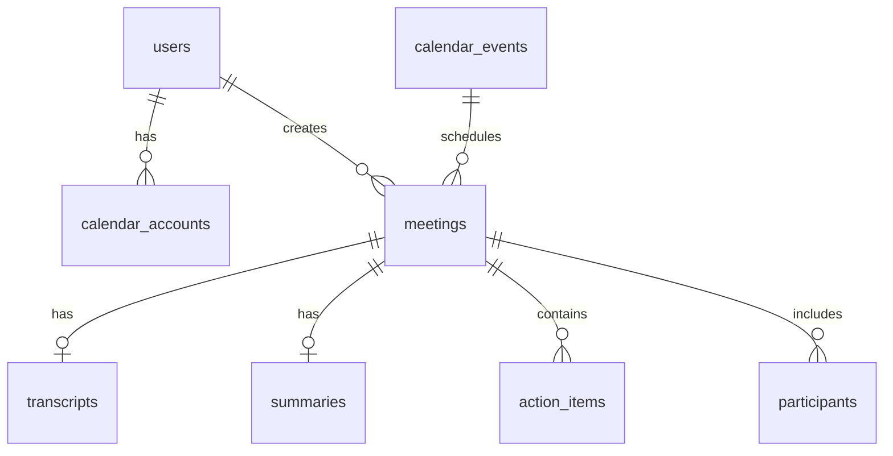

# Database Schema Documentation

> **Last Updated:** 2026-01-05  
> **Database:** PostgreSQL (Supabase)  
> **ORM:** Prisma

---

## Integration Compliance Matrix

| Service | Status | Notes |
|---------|--------|-------|
| **MeetingBaas API v2** | ✅ | All bot status codes, error codes, callback support |
| **Supabase** | ✅ | RLS policies, `auth.uid()`, real-time ready |
| **Google Calendar** | ✅ | OAuth tokens, event sync, refresh tokens |
| **Vercel** | ✅ | Serverless compatible, connection pooling via `directUrl` |
| **Claude AI** | ✅ | Summary generation, action item extraction |

---

## Architecture: Local-First Data Strategy

The application follows a **local-first** approach to minimize external API dependencies:

```
┌───────────────┐     ┌──────────────────┐     ┌─────────────────┐
│  MeetingBaas  │────▶│  Force Sync      │────▶│   Supabase DB   │
│     API       │     │  (/api/bots?sync)│     │  (Local Store)  │
└───────────────┘     └──────────────────┘     └────────┬────────┘
                                                        │
                                                        ▼
                      ┌──────────────────┐     ┌─────────────────┐
                      │   Meeting Detail │◀────│   Local-First   │
                      │   Page (UI)      │     │   API Routes    │
                      └──────────────────┘     └─────────────────┘
```

### Data Flow

1. **Sync Once**: `GET /api/bots?sync=true` fetches from MeetingBaas and stores locally
2. **Serve Locally**: All subsequent reads come from Supabase (no external API calls)
3. **Generate AI Locally**: If transcript exists but summary doesn't, generate from local data
4. **Fallback Only**: MeetingBaas API is only called if data doesn't exist locally

---

## Entity Relationship Diagram



---

## Tables Overview

| Table | Purpose | Key Integrations |
|-------|---------|------------------|
| `users` | User profiles (synced from auth) | Supabase Auth |
| `calendar_accounts` | OAuth tokens | Google Calendar, MeetingBaas |
| `meetings` | Bot recordings | MeetingBaas API |
| `transcripts` | Full transcripts | Gladia (via MeetingBaas) |
| `summaries` | AI summaries | Claude AI |
| `action_items` | Extracted tasks | Claude AI |
| `participants` | Meeting attendees | MeetingBaas API |
| `calendar_events` | Cached calendar events | Google Calendar (cached) |

---

## Table: `users`

Stores user profile data synced from **Supabase Auth**.

| Column | Type | Description |
|--------|------|-------------|
| `id` | UUID | Primary key. **Must match Supabase Auth `auth.uid()`** |
| `email` | TEXT | Unique email address |
| `name` | TEXT | Display name |
| `avatar_url` | TEXT | Profile picture URL |
| `created_at` | TIMESTAMPTZ | Account creation time |
| `updated_at` | TIMESTAMPTZ | Last update (auto-trigger) |

### User Sync Mechanism

Users are synced from `auth.users` to `public.users` automatically via:

1. **Middleware** - On every page visit
2. **API Routes** - Before any authenticated database operation

```typescript
// lib/utils/ensure-user.ts
await ensureUserExists(authUser)  // Called in all authenticated routes
```

This ensures the user record exists before creating related records (meetings, calendars, etc.).

**RLS Policy:** Users can only read/update their own row.

---

## Table: `calendar_accounts`

Stores **Google Calendar OAuth tokens** for calendar sync.

| Column | Type | Description |
|--------|------|-------------|
| `id` | UUID | Primary key |
| `user_id` | UUID | FK → `users.id` |
| `provider` | TEXT | `google` or `microsoft` |
| `email` | TEXT | Calendar account email |
| `access_token` | TEXT | OAuth access token (🔒 encrypted) |
| `refresh_token` | TEXT | OAuth refresh token (🔒 encrypted) |
| `expires_at` | TIMESTAMPTZ | Token expiration |
| `scope` | TEXT | OAuth scopes granted |
| `meetingbaas_calendar_id` | TEXT | MeetingBaas calendar UUID |
| `is_active` | BOOLEAN | Whether sync is enabled |

**Unique Constraint:** `(user_id, provider, email)`

**References:**
- [Google OAuth 2.0](https://developers.google.com/identity/protocols/oauth2)
- [MeetingBaas POST /calendars](https://doc.meetingbaas.com/api-reference/calendars/sync-calendar)

---

## Table: `meetings`

Stores **MeetingBaas bot** recordings and metadata. This is the **local cache** of meeting data.

| Column | Type | MeetingBaas Field | Description |
|--------|------|-------------------|-------------|
| `id` | UUID | - | Internal ID |
| `user_id` | UUID | - | FK → `users.id` |
| `bot_id` | TEXT | `bot_id` | MeetingBaas bot UUID (unique) |
| `bot_name` | TEXT | `bot_name` | Display name in meeting |
| `meeting_url` | TEXT | `meeting_url` | Zoom/Meet/Teams URL |
| `calendar_event_id` | TEXT | `event_id` | If scheduled via calendar |
| `status` | TEXT | `status` | See status codes below |
| `recording_mode` | TEXT | `recording_mode` | `speaker_view`, `gallery_view`, `audio_only` |
| `duration_seconds` | INT | `duration_seconds` | Recording length |
| `participant_count` | INT | - | Number of attendees |
| `video_url` | TEXT | `mp4` | Recording download URL |
| `audio_url` | TEXT | - | Audio-only URL |
| `transcript_url` | TEXT | `transcript.txt` | Transcript file URL |
| `diarization_url` | TEXT | `diarization` | Speaker identification |
| `error_code` | TEXT | `error_code` | See error codes below |
| `error_message` | TEXT | `error_message` | Human-readable error |
| `end_reason` | TEXT | `end_reason` | Why recording ended |
| `created_at` | TIMESTAMPTZ | `created_at` | Bot creation time |
| `updated_at` | TIMESTAMPTZ | - | Last update |
| `completed_at` | TIMESTAMPTZ | - | When recording finished |

### Bot Status Codes

Per [MeetingBaas API v2](https://doc.meetingbaas.com/api-reference/bots/get-meeting-data):

| Status | Description |
|--------|-------------|
| `queued` | Bot created, waiting to join |
| `joining_call` | Bot is joining the meeting |
| `in_waiting_room` | Bot is in waiting room |
| `in_call_not_recording` | Bot in call, not recording yet |
| `in_call_recording` | Bot actively recording |
| `recording_paused` | Recording paused |
| `recording_resumed` | Recording resumed |
| `transcribing` | Processing transcription |
| `completed` | Successfully completed |
| `failed` | Bot failed (see `error_code`) |

### Error Codes

Per [MeetingBaas Error Reference](https://doc.meetingbaas.com/api-reference/bots/get-meeting-data):

| Code | Description |
|------|-------------|
| `BOT_NOT_ACCEPTED` | Participants didn't admit bot |
| `TIMEOUT_WAITING_TO_START` | No one joined meeting |
| `CANNOT_JOIN_MEETING` | Meeting not reachable |
| `INVALID_MEETING_URL` | URL format invalid |
| `TRANSCRIPTION_FAILED` | Transcription error (retry-able) |
| `INSUFFICIENT_TOKENS` | Account balance issue |
| `DAILY_BOT_CAP_REACHED` | Daily limit exceeded |

---

## Table: `transcripts`

Stores full transcript JSON from **Gladia** (via MeetingBaas). One-to-one with `meetings`.

| Column | Type | Description |
|--------|------|-------------|
| `id` | UUID | Primary key |
| `meeting_id` | UUID | FK → `meetings.id` (unique) |
| `data` | JSONB | Full transcript with utterances |
| `created_at` | TIMESTAMPTZ | When stored |

**JSON Structure:**
```json
[
  {
    "speaker": 0,
    "text": "Hello everyone",
    "start": 0.0,
    "end": 1.5,
    "words": [...]
  }
]
```

---

## Table: `summaries`

Stores AI-generated summaries from **Claude AI**. One-to-one with `meetings`.

| Column | Type | Description |
|--------|------|-------------|
| `id` | UUID | Primary key |
| `meeting_id` | UUID | FK → `meetings.id` (unique) |
| `overview` | TEXT | Meeting summary paragraph |
| `key_points` | TEXT[] | Bullet points array |
| `decisions` | TEXT[] | Decisions made |
| `next_steps` | TEXT[] | Follow-up actions |
| `created_at` | TIMESTAMPTZ | When generated |

### AI Generation Flow

1. Transcript fetched from MeetingBaas (or read from local `transcripts` table)
2. Claude AI generates summary and extracts action items
3. Results saved to `summaries` and `action_items` tables
4. Subsequent requests serve from local database (no AI re-generation)

---

## Table: `action_items`

Extracted tasks from meetings via **Claude AI**. Many-to-one with `meetings`.

| Column | Type | Description |
|--------|------|-------------|
| `id` | UUID | Primary key |
| `meeting_id` | UUID | FK → `meetings.id` |
| `description` | TEXT | Task description |
| `assignee` | TEXT | Person responsible (nullable) |
| `due_date` | TEXT | Due date string (nullable) |
| `completed` | BOOLEAN | Completion status (default: false) |
| `created_at` | TIMESTAMPTZ | When extracted |
| `updated_at` | TIMESTAMPTZ | Last update |

---

## Table: `participants`

Meeting attendees from MeetingBaas.

| Column | Type | Description |
|--------|------|-------------|
| `id` | UUID | Primary key |
| `meeting_id` | UUID | FK → `meetings.id` |
| `name` | TEXT | Participant name |
| `email` | TEXT | Email if available |
| `role` | TEXT | `host`, `participant` |
| `joined_at` | TIMESTAMPTZ | Join time |
| `left_at` | TIMESTAMPTZ | Leave time |

---

## Table: `calendar_events`

Cached calendar events to reduce external API calls. TTL: 8 hours.

| Column | Type | Description |
|--------|------|-------------|
| `id` | UUID | Primary key |
| `event_id` | TEXT | Google Calendar event ID (unique) |
| `calendar_id` | TEXT | MeetingBaas calendar UUID |
| `title` | TEXT | Event title |
| `start_time` | TIMESTAMPTZ | Event start |
| `end_time` | TIMESTAMPTZ | Event end |
| `meeting_url` | TEXT | Zoom/Meet/Teams URL |
| `platform` | TEXT | `zoom`, `google_meet`, `teams` |
| `bot_scheduled` | BOOLEAN | Whether bot is scheduled |
| `raw_data` | JSONB | Full event data from API |
| `last_fetched_at` | TIMESTAMPTZ | Cache timestamp |

### Caching Strategy

```typescript
// 8-hour cache expiry
const eightHoursAgo = new Date(Date.now() - 8 * 60 * 60 * 1000)

// Check if cache is valid
if (cachedEvent.lastFetchedAt > eightHoursAgo) {
  return cachedEvent  // Serve from cache
}
// Otherwise fetch fresh from Google Calendar via MeetingBaas
```

---

## Indices

| Index | Table | Columns | Purpose |
|-------|-------|---------|---------|
| `meetings_pkey` | meetings | id | Primary key |
| `meetings_bot_id_key` | meetings | bot_id | Unique constraint |
| `idx_meetings_user_created` | meetings | user_id, created_at | User's meetings list |
| `idx_meetings_status` | meetings | status | Status filtering |
| `idx_meetings_calendar_event` | meetings | calendar_event_id | Calendar sync |
| `idx_meetings_status_created` | meetings | status, created_at DESC | Dashboard queries |
| `idx_calendar_accounts_mb_id` | calendar_accounts | meetingbaas_calendar_id | Calendar lookups |
| `idx_action_items_meeting` | action_items | meeting_id | Meeting action items |
| `idx_participants_meeting` | participants | meeting_id | Meeting participants |
| `idx_calendar_events_calendar` | calendar_events | calendar_id | Calendar filtering |

---

## Row Level Security

All tables have RLS enabled. Users can only access their own data.

```sql
-- Example policy
CREATE POLICY "Users can view own meetings" ON meetings
  FOR SELECT USING (auth.uid() = user_id);
```

---

## Data Lifecycle

```
┌─────────────────────────────────────────────────────────────────────────┐
│                          MEETING LIFECYCLE                               │
├─────────────────────────────────────────────────────────────────────────┤
│                                                                          │
│  1. CREATE BOT                                                           │
│     POST /api/bots → MeetingBaas → Save to `meetings` (status: queued)  │
│                                                                          │
│  2. BOT RECORDS                                                          │
│     Webhook updates → status: in_call_recording                         │
│                                                                          │
│  3. SYNC COMPLETED                                                       │
│     GET /api/bots?sync=true                                             │
│     ├── Fetch bot details from MeetingBaas                              │
│     ├── Download transcript → Save to `transcripts`                     │
│     ├── Generate AI summary → Save to `summaries`                       │
│     ├── Extract action items → Save to `action_items`                   │
│     └── Update `meetings` with video/audio URLs                         │
│                                                                          │
│  4. VIEW MEETING (Local-First)                                           │
│     GET /api/bots/:id                                                   │
│     ├── Check `meetings` table (with joins)                             │
│     ├── If exists → Return from DB (no external calls)                  │
│     ├── If missing summary → Generate from local transcript             │
│     └── Fallback → Fetch from MeetingBaas (rare)                        │
│                                                                          │
└─────────────────────────────────────────────────────────────────────────┘
```

---

## References

- [MeetingBaas API v2 Docs](https://doc.meetingbaas.com)
- [Supabase Auth](https://supabase.com/docs/guides/auth)
- [Google Calendar API](https://developers.google.com/calendar/api)
- [Prisma with Supabase](https://www.prisma.io/docs/guides/database/supabase)
- [Claude AI API](https://docs.anthropic.com/claude/reference)
